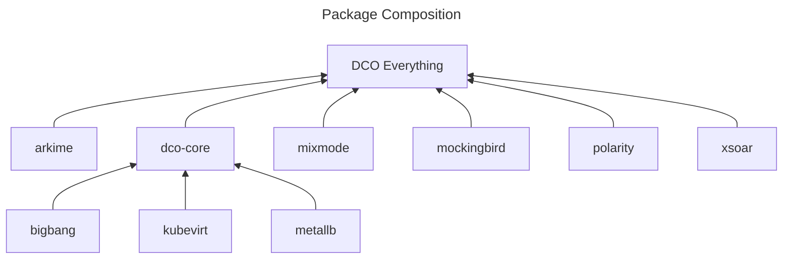
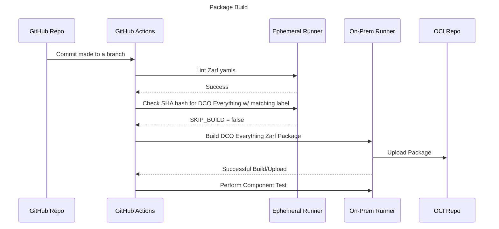

## Zarf package for full DCO suite

### Description

This folder contains a Zarf package definition which includes _all_ of the
projects in the DCO umbrella. It is intended for a one-shot deployment model
where an entire DCO suite can be provisioned in a single step.

DCO Everything is set up to import individual _Zarf components_ which are
defined in their respective sub-packages. For instance, the
[Arkime Zarf package](../arkime/zarf.yaml) contains a single component,
`arkime.` The [DCO Core Zarf package](../dco-core/zarf.yaml) contains
several components: `flux`, `bigbang`, `setup`, `kubevirt`, `cdi`,
`metallb`, `metallb-config` and `dataplane-ek`. This DCO Everything
package imports each of those components individually.

### Building the DCO Everything Package

We recommend using our GitHub Actions workflows, but you can manually
build as well:

```shell
> git clone https://github.com/naps-dev/dco-core
> cd dco-core/dco-everything
> zarf package create \
  --set GIT_REF=${GIT_BRANCH_OR_TAG} \
  --set VERSION=${VERSION} \
  --set SOURCE=${SOURCE} \
  --skip-sbom \
  --confirm
```

See our [build workflow](../.github/workflows/rebuild-everything.yaml) for
examples of what to set `$GIT_REF`, `$VERSION` and `$SOURCE` to. `$GIT_REF` is
needed for the internal flux reconciliation which takes place to reference
the proper Git branch and commit for a given deployment. `$VERSION` is set as
either the current Git branch or tag and is used to identify the package, and
`$SOURCE` is set as the SHA of the current commit. This is used to avoid
rebuilds by separate component workflows as part of the same commit or PR.

### Deployment

To deploy the package, we recommend that 

### Contents

* [arkime](../arkime/)
* [dco-core](../dco-core/)
    * [bigbang](../bigbang)
    * [dataplane-ek](../dataplane-ek/)
    * [metallb](../metallb/)
* [kasm](../kasm/)
* [mixmode](../mixmode/)
* [mockingbird](../mockingbird/)
* [polarity](../polarity/)
* [suricata](../suricata/)
* [xsoar](../xsoar/)

### Package Organization



### Package Build Process


